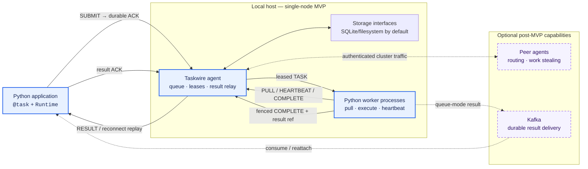

# Taskwire

Taskwire is a lightweight, opinionated, optionally distributed task processing framework for Python. It is designed to help developers manage and execute tasks efficiently across multiple systems. With Taskwire, you can easily define, schedule, and monitor tasks, making it an ideal choice for building scalable and reliable distributed applications.

## Features

- **Lightweight**: Minimal overhead, ensuring high performance.
- **Opinionated**: Provides best practices and sensible defaults.
- **Distributed** (optional): Seamlessly handles task distribution across multiple nodes.
- **Pythonic**: Designed to work naturally with Python's syntax and conventions.

## Project Status

Taskwire is currently an architecture and implementation plan; the package and agent described below have not been implemented in this repository yet. Do not rely on the placeholder `pip install` workflow for production use.

Start with the [architecture](docs/architecture.md), the [critical plan review](docs/implementation-plan-review.md), and the phase documents under `docs/phases/`. [Phase 9](docs/phases/phase-9-examples-use-cases.md) defines the quick start, runnable examples, and recommended use cases that will accompany the implementation.

The corrected delivery order makes Phases 0–4 the single-node MVP. Clustering and Kafka delivery are separate post-MVP feature gates.

## How the Idea Fits Together



```text
┌──────────────────────────────┐
│ Python application           │
│ @task · Runtime · Future     │
└──────────────┬───────────────┘
               │ SUBMIT
               │ ◄── durable ACK
               ▼
┌──────────────────────────────┐       authenticated       ┌─────────────────────┐
│ Taskwire agent               │◄────── cluster traffic ──►│ Peer agents         │
│ queue · leases · result relay│                            │ route · steal work  │
└──────────────┬───────────────┘                            └─────────────────────┘
               │ leased TASK
               │ ◄── PULL / HEARTBEAT / COMPLETE
               ▼
┌──────────────────────────────┐
│ Python worker processes      │
│ deserialize · execute        │
└───────────┬──────────────┬───┘
            │              │
            │ result reference
            ▼
┌───────────────────────────────────────────────┐
│ Agent storage                                │
│ state: memory / SQLite / PostgreSQL          │
│ objects: memory / filesystem / S3            │
└──────────────────────┬────────────────────────┘
                       │ RESULT / reconnect replay
                       └──────────────────► Application

Solid path: single-node MVP    Side paths: optional post-MVP capabilities
```

The agent replaces an external broker for the core workflow. Applications submit task references and small values—or object references for larger values—over a protected local socket. Workers pull tasks and return fenced result references to the agent; they never connect back to applications. Task state and immutable objects use separate storage interfaces, with SQLite and the filesystem as zero-infrastructure defaults. See the [storage architecture](docs/storage.md).

## Contributing

Contributions should follow the phase acceptance gates and preserve the protocol/config parity requirements in the plan review.

## License

Taskwire is licensed under the MIT License. See [LICENSE](LICENSE).
